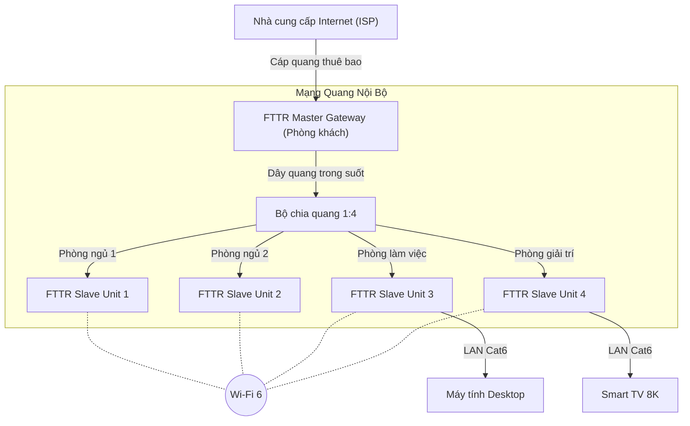

# Báo cáo Nghiên cứu: Công nghệ FTTR, Phương thức Triển khai và Yếu tố Thiết bị Đặc thù

## Tổng quan

**FTTR (Fiber to the Room)** là công nghệ mạng tiên tiến thay thế cáp mạng truyền thống (CAT5E/CAT6) bằng cáp quang kéo đến từng phòng. Khác với FTTH (Fiber to the Home) chỉ dừng lại ở cửa nhà hoặc phòng khách, FTTR mở rộng kết nối quang đến mọi ngóc ngách, đảm bảo băng thông Gigabit ổn định, độ trễ thấp và phủ sóng Wi-Fi 6/7 liền mạch toàn bộ căn hộ/tòa nhà.

### Mục tiêu của báo cáo

- Cung cấp cái nhìn chi tiết về kiến trúc và nguyên lý hoạt động của FTTR.
- Phân tích các phương thức triển khai thực tế (đặc biệt là giải pháp cáp quang trong suốt).
- Liệt kê chi tiết các thiết bị và vật tư đặc thù cần thiết cho hệ thống.

---

## Nội dung chính

### 1. Công nghệ FTTR là gì?

FTTR là giải pháp "Phủ sóng quang toàn bộ ngôi nhà". Nó khắc phục nhược điểm của Wi-Fi Mesh truyền thống (sử dụng sóng vô tuyến để kết nối các node, dễ bị suy hao và nhiễu) bằng cách sử dụng **sợi quang** làm môi trường truyền dẫn giữa thiết bị trung tâm và các điểm truy cập vệ tinh.

**Lợi ích cốt lõi:**

- **Tốc độ:** Băng thông có thể đạt 1-10Gbps tới từng phòng.
- **Ổn định:** Không bị nhiễu điện từ, độ trễ cực thấp (phù hợp gaming, VR/AR, hội nghị truyền hình 4K).
- **Thẩm mỹ:** Sử dụng công nghệ cáp quang trong suốt (Invisible Fiber) giúp đi dây nổi mà như không dây.
- **Chuyển vùng (Roaming):** Chuyển vùng liền mạch (mili-giây) giữa các phòng.

### 2. Phương thức triển khai

Quy trình triển khai FTTR thường tuân theo các bước tiêu chuẩn sau, với điểm nhấn kỹ thuật nằm ở khâu thi công cáp quang:

#### a. Kịch bản triển khai

Có hai kịch bản chính:

1. **Nhà mới/Đang xây dựng:** Triển khai cáp quang luồn ống ngầm (conduit) tương tự như hệ thống điện nhẹ.
2. **Nhà hiện trạng (Retrofit):** Đây là ưu điểm lớn nhất của FTTR. Sử dụng **cáp quang trong suốt (Transparent Optical Cable)** đi nổi dọc theo len chân tường, mép cửa, góc trần.

#### b. Quy trình thi công (Tập trung vào giải pháp đi nổi thẩm mỹ)

1. **Khảo sát & Thiết kế:**
    - Xác định vị trí đặt FTTR Master (thường tại phòng khách/tủ kỹ thuật).
    - Xác định vị trí các FTTR Slave (phòng ngủ, phòng làm việc).
    - Vẽ lộ trình đi dây quang tối ưu để đảm bảo thẩm mỹ.

2. **Thi công cáp quang:**
    - Sử dụng súng bắn keo nóng (hot melt glue gun) chuyên dụng hoặc kẹp clip để cố định dây quang trong suốt.
    - Dây quang có đường kính rất nhỏ (khoảng 1.2mm - 2.0mm) và vỏ trong suốt, gần như tàng hình trên nền tường trắng.
    - Sử dụng các phụ kiện góc (corner protect) để đảm bảo bán kính uốn cong của sợi quang không bị gãy (dù cáp FTTR thường là loại *Bend-insensitive fiber* - chịu uốn cong tốt).

3. **Lắp đặt & Hàn nối:**
    - Thi công điểm phân chia quang (Splitter) nếu cần chia tín hiệu từ Master ra nhiều nhánh.
    - Tại các điểm cuối (phòng), sử dụng mặt hạt quang (ATB - Access Terminal Box) tường hoặc đấu nối trực tiếp vào Slave Unit.
    - Sử dụng máy hàn quang hoặc đầu nối nhanh (Fast Connector) để bấm đầu dây.

4. **Cấu hình & Nghiệm thu:**
    - Cấu hình Wi-Fi đồng bộ (SSID, Password) trên Master. Master sẽ tự động đồng bộ xuống các Slave.
    - Đo kiểm công suất quang (Optical Power) tại các điểm Slave để đảm bảo tín hiệu đạt chuẩn (thường từ -15dBm đến -25dBm).
    - Test tốc độ và khả năng Roaming.

---

### 3. Các yếu tố Thiết bị và Vật tư đặc thù

Hệ thống FTTR yêu cầu một bộ thiết bị khác biệt so với mạng LAN/Wi-Fi truyền thống:

#### A. Thiết bị chủ động (Active Equipment)

| Thiết bị | Tên gọi kỹ thuật | Vai trò | Đặc điểm nổi bật |
| :--- | :--- | :--- | :--- |
| **FTTR Master Gateway** | Primary ONT / Master ONU | Bộ não của hệ thống | - Kết nối Internet từ nhà mạng (qua cổng XGS-PON/GPON). - Tích hợp OLT mini để quản lý mạng quang nội bộ. - Cấp nguồn và tín hiệu quang xuống các Slave. |
| **FTTR Slave Unit** | Edge ONT / Slave ONU | Điểm truy cập vệ tinh | - Đặt tại từng phòng. - Nhận tín hiệu quang từ Master. - Phát Wi-Fi 6/7 và cung cấp cổng LAN Gigabit cho PC/TV. - Thiết kế nhỏ gọn, thẩm mỹ (dạng âm tường hoặc để bàn). |

#### B. Vật tư thụ động & Thi công (Passive & Tools)

1. **Cáp quang trong suốt (Transparent/Invisible Fiber):**
    - Là "linh hồn" của việc triển khai nhà cũ.
    - Đặc tính: Vỏ polymer trong suốt, đường kính siêu nhỏ, chịu uốn cong cực tốt (G.657.B3).
    - Mục đích: Đi nổi trên tường mà không làm mất thẩm mỹ nội thất.

2. **Bộ chia quang (PLC Splitter):**
    - Dùng để chia tín hiệu từ 1 sợi quang (từ Master) ra nhiều sợi (đến các Slave).
    - Tỷ lệ chia thường là 1:4 hoặc 1:8, hoặc dùng bộ chia không cân bằng (uneven splitter) để đi dây dạng chuỗi (Daisy-chain).

3. **ATB (Access Terminal Box):**
    - Hộp phối quang mini/mặt hạt quang tại điểm cuối trong phòng, nơi chuyển tiếp từ dây quang đi dây sang dây nhảy quang vào thiết bị Slave.

4. **Công cụ thi công chuyên dụng:**
    - **Súng bắn keo nhiệt:** Dùng để dán dây quang trong suốt lên tường/trần.
    - **Máy hàn cáp quang (Fusion Splicer):** Đảm bảo suy hao mối nối thấp nhất.
    - **Bút soi quang (VFL) & Máy đo công suất (OPM):** Để kiểm tra thông quang và chất lượng tín hiệu.

---

## Sơ đồ minh họa kiến trúc FTTR

## Kết luận

Giải pháp FTTR đại diện cho bước tiến tiếp theo của hạ tầng mạng gia đình. Bằng cách mang cáp quang đến tận phòng, FTTR loại bỏ hoàn toàn nút thắt cổ chai về băng thông của cáp đồng và Wi-Fi truyền thống.

**Điểm mấu chốt cần nhớ:**

1. **Thiết bị:** Cần bộ Master (làm OLT nội bộ) và Slave (làm ONU vệ tinh).
2. **Vật tư:** Cáp quang trong suốt là yếu tố then chốt để triển khai thẩm mỹ cho nhà đã hoàn thiện.
3. **Triển khai:** Đòi hỏi kỹ thuật viên có thiết bị chuyên dụng (hàn quang, đi dây thẩm mỹ) cao hơn so với bấm mạng thông thường.

## Nguồn tham khảo

- Các tài liệu kỹ thuật về kiến trúc FTTR của Huawei, ZTE.
- Tiêu chuẩn kỹ thuật G.657 (Cáp quang chịu uốn cong).
- Các bài viết chuyên ngành về xu hướng công nghệ mạng FTTx năm 2024-2025.
